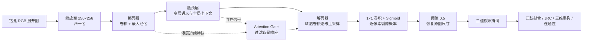
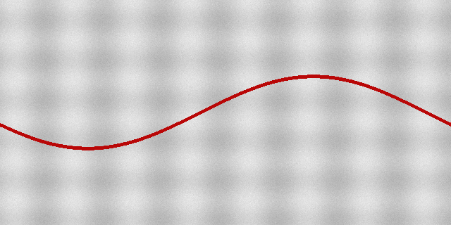

# Borehole Fracture Analysis

一个可安装、可测试的钻孔成像裂隙分析工程，覆盖 Attention U-Net 分割、裂隙正弦拟合、JRC 粗糙度估计、三维平面重构、连通性分析与补孔候选位置计算。

> 当前仓库适合发布“代码”。本地原始附件、300 组训练样本、模型权重和生成结果没有附带可验证的再分发许可，因此已由 `.gitignore` 排除，不能随代码直接上传 GitHub。详见 [数据说明](docs/data.md) 和 [NOTICE](NOTICE)。

## 功能模块

| 命令 | Python 模块 | 作用 |
|---|---|---|
| `demo` | `demo.py` | 无外部数据依赖的合成图像与演示模型推理 |
| `segment` | `segmentation.py` | Attention U-Net 训练与裂隙掩码预测 |
| `fit-sinusoids` | `sinusoidal_fitting.py` | DBSCAN 聚类与正弦参数拟合 |
| `analyze-roughness` | `roughness_analysis.py` | 平整化、采样和 JRC 估计 |
| `reconstruct` | `reconstruction.py`、`connectivity.py` | 三维平面拟合、连通概率和补孔候选 |

## 为什么采用 Attention U-Net 识别钻孔裂隙

> 术语说明：本项目当前标注和模型识别的是钻孔展开图中的**裂隙/结构面像素**，不是显微图像或 CT 中的岩石孔隙。若研究对象确为孔隙，需要重新定义标注规范、训练数据和评价指标，不能直接把现有裂隙模型解释为孔隙识别模型。

这不是普通的“整张图有没有裂隙”分类任务，而是要判断**每个像素是否属于裂隙**，因此采用语义分割模型。选择 Attention U-Net（亦写作 AU-Net）的理由如下：

1. **同时保留整体形态和细线边界。** U-Net 的编码器通过下采样提取岩体纹理、走向等上下文，解码器恢复空间分辨率；跳跃连接把浅层的边缘和位置细节送到解码端，适合输出与输入同尺寸的逐像素掩码。U-Net 原论文将这种结构概括为“收缩路径捕获上下文、对称扩张路径实现精确定位”[1]。
2. **抑制复杂背景干扰。** 钻孔图像会受到岩石纹理、矿物色差、照明不均和成像噪声影响，裂隙通常又细长、占比小。相关钻孔结构面分割研究也指出，孔内光源、不同岩性反射差异会降低图像质量，并验证了 U 形编码器—解码器进行像素级分割的可行性[3]。本项目据此作出的工程推断是：在 U-Net 跳跃连接前增加注意力门，可减少无关纹理直接进入解码器。
3. **注意力门能够学习“看哪里”。** Attention U-Net 原论文提出用高层语义作为门控信号，对浅层特征生成 0～1 的空间权重，突出与目标有关的区域、抑制无关响应；该模块可直接嵌入 U-Net，且额外计算开销较小[2]。这与“裂隙弱、背景纹理强”的识别难点相匹配。
4. **适配前景/背景不平衡。** 裂隙像素远少于背景像素。本实现训练时使用 `0.5 × 加权 BCE + 0.5 × Dice loss`，并提高正类像素权重，使模型既学习像素概率，又关注裂隙区域的重叠程度。

以上依据说明了 Attention U-Net **为什么适合作为本项目的基线模型**，但不等于它已被证明优于所有分割网络。当前仓库没有在同一数据划分上完成 U-Net、Attention U-Net、U²-Net 等模型的消融对比；因此 README 不作“最优模型”结论。现有 300 对样本按固定随机种子随机划分为 240 对训练、60 对验证，最佳内部验证 F1 为 0.4467，仍需独立钻孔、不同岩性和不同设备数据进行外部验证。

### 作为图像识别流程时如何工作



具体对应 [`segmentation.py`](src/borehole_fracture_analysis/segmentation.py) 中的实现：

1. 输入图像转换为 RGB，双线性缩放至 `256 × 256`，再按 ImageNet 均值和标准差归一化。训练标签使用最近邻缩放，避免产生不存在的中间类别。
2. 编码器通过四次最大池化，把通道数从 `64` 逐级增加到 `1024`，以较低分辨率提取更大范围的纹理和形态上下文。
3. 解码器通过转置卷积逐级恢复分辨率。每一级并非直接复制编码器特征，而是先经过注意力门：

   ```text
   α = sigmoid(ψ(ReLU(Wg(g) + Wx(x))))
   x_attended = α × x
   ```

   其中 `x` 是编码器的浅层特征，`g` 是解码器的高层门控信号，`α` 是逐位置注意力权重。过滤后的 `x_attended` 与上采样特征拼接，再经过双卷积细化边界。
4. 最后的 `1 × 1` 卷积把 64 个特征通道压缩为一个通道，Sigmoid 输出每个像素属于裂隙的概率。推理时默认以 `0.5` 二值化，再恢复到原图尺寸，保存为**黑色裂隙、白色背景**的掩码。
5. 掩码不是流程终点：后续模块从裂隙轨迹拟合正弦参数、估计粗糙度/JRC、重建三维平面并分析可能的连通关系。因此，分割边界的漏检和误检会继续传递到后续计算。

### 论文依据

1. Ronneberger O, Fischer P, Brox T. [U-Net: Convolutional Networks for Biomedical Image Segmentation](https://arxiv.org/abs/1505.04597). MICCAI, 2015.
2. Oktay O, et al. [Attention U-Net: Learning Where to Look for the Pancreas](https://arxiv.org/abs/1804.03999). MIDL, 2018.
3. Yu Q, Wang G, Cheng H, et al. [The segmentation and intelligent recognition of structural surfaces in borehole images based on the U²-Net network](https://doi.org/10.1371/journal.pone.0299471). PLOS ONE, 2024.

## 安装

推荐 Python 3.10 或 3.11：

```powershell
git clone https://github.com/TensorJade/Borehole-Fracture-Analysis.git
cd Borehole-Fracture-Analysis
python -m venv .venv
.\.venv\Scripts\Activate.ps1
python -m pip install --upgrade pip
python -m pip install -e ".[dev]"
```

若只运行、不开发，可使用 `python -m pip install -e .`。

## 克隆后直接演示

演示命令不需要下载数据集或研究模型权重：

```powershell
borehole-fracture demo
```

它会自动生成一张合成钻孔展开图，并在 `artifacts/demo/` 输出：

- `synthetic_borehole.png`：合成输入图像；
- `demo_fracture_mask.png`：黑色裂隙、白色背景的预测掩码；
- `demo_overlay.png`：红色裂隙叠加图；
- `demo_summary.json`：调用参数和输出摘要。



也可以直接运行 Python 用例：

```powershell
python examples/run_demo.py --output artifacts/my-demo
```

或者在代码中调用：

```python
from pathlib import Path

from borehole_fracture_analysis.demo import run_demo

outputs = run_demo(Path("artifacts/api-demo"))
print(outputs["overlay_image"])
```

可直接执行的模型参数位于 [`demo_linear_segmenter.json`](src/borehole_fracture_analysis/resources/demo_linear_segmenter.json)。它是随代码发布的合成演示参数，不是论文训练得到的 Attention U-Net 权重，不能用于科研指标或工程判断。详细说明见 [演示模型说明](docs/demo.md)。

## 准备数据

按以下结构放置本地数据，文件名规则与完整字段见 [docs/data.md](docs/data.md)：

```text
data/
├── raw/
│   ├── segmentation-images/
│   ├── sinusoidal-fractures/
│   ├── roughness-images/
│   └── borehole-scans/hole-01/...
└── training/
    ├── images/<sample-id>.<ext>
    └── masks/<sample-id>_mask.png
```

模型默认路径为 `models/au_net_crack.pth`。

## 使用

```powershell
borehole-fracture check
borehole-fracture demo
borehole-fracture train --epochs 100 --batch-size 16
borehole-fracture segment
borehole-fracture fit-sinusoids
borehole-fracture analyze-roughness
borehole-fracture reconstruct
borehole-fracture run-all
```

未安装命令行入口时，也可以使用 `python -m borehole_fracture_analysis check`。Windows 用户还可运行 `run-project.bat check`。所有生成文件写入 `artifacts/`，不会覆盖原始数据。

## 开发与验证

```powershell
ruff check .
pytest --cov=borehole_fracture_analysis --cov-report=term-missing
```

架构、复现记录和开发约定分别见 [架构说明](docs/architecture.md)、[复现记录](docs/reproducibility.md)、[验证记录](docs/verification.md)、[依赖审计](docs/dependencies.md)、[发布清单](docs/release-checklist.md)、[开发规范](docs/development-standards.md) 和 [贡献指南](CONTRIBUTING.md)。

## 科学与工程边界

- 当前权重由本地 300 对样本按固定随机种子划分为 240 对训练、60 对验证得到；这不是独立外部验证。
- JRC 为图像经验估计，没有现场真值时不得解释为工程验收值。
- 连通概率和补孔坐标来自简化几何规则，只能作为候选方案，不能替代地质调查和现场决策。
- 精确复现论文表格仍需要原始固定划分、数据版本、标注说明、训练日志和现场真值。

## 许可

源代码采用 [MIT License](LICENSE)。数据、模型权重与输出不自动获得该许可。
