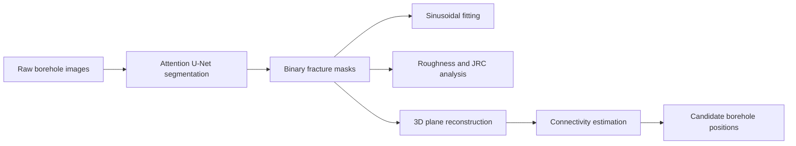

# Architecture

## 系统概览



命令行层只负责参数、日志和阶段编排；算法模块不依赖当前工作目录，所有默认路径集中定义在 `config.py`。

## 目录职责

```text
src/borehole_fracture_analysis/
├── cli.py                    # 公共命令行入口与阶段编排
├── config.py                 # 路径、钻孔坐标和物理常量
├── demo.py                   # 合成输入与可分发的轻量演示模型
├── segmentation.py           # 数据配对、训练、推理
├── sinusoidal_fitting.py     # 聚类和正弦拟合
├── roughness_analysis.py     # 平整化、采样和 JRC
├── reconstruction.py        # 二维掩码到三维平面
└── connectivity.py          # 连通概率与候选补孔位置
```

## 数据流与失败边界

1. `check` 检查四组原始数据、训练配对和可选模型权重。
2. `segment` 递归读取图像并保持目录层次生成掩码。
3. 三个下游分析模块分别消费自己的掩码目录，互不覆盖。
4. 连通性模块只消费重构生成的标准 CSV，不直接读取图像。
5. 缺少输入、格式不匹配或没有有效组件时立即抛出异常，CLI 返回非零退出码。

## 算法边界

- 分割：Attention U-Net，训练损失为加权 BCE 与 Dice 的等权组合。
- 正弦拟合：DBSCAN 聚类后使用稳健最小二乘拟合。
- 粗糙度：先去除正弦/趋势，再进行采样并计算 Z2 与经验 JRC。
- 重构：按钻孔位置、周向角和深度区间映射至三维坐标，以 SVD 拟合平面。
- 连通：同孔依据空间距离，跨孔依据法向夹角和 JRC 差构造启发式概率。

这些概率不是经现场标注校准的统计概率，不能直接用于施工决策。
