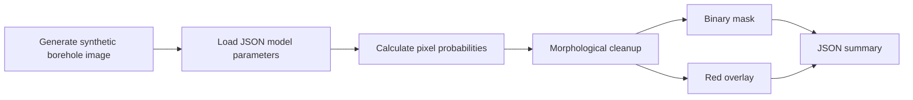

# Runnable Demonstration

## Purpose and boundary

The repository includes a deterministic demonstration so a new user can verify installation and API usage without downloading external data or an Attention U-Net checkpoint.

The demo proves the packaging, command-line entry point, image IO, parameter loading, probability calculation, mask export, and overlay export. It does not reproduce the paper model and must not be used to report scientific accuracy or make engineering decisions.

## Execution flow



## Model contract

Parameter file: `src/borehole_fracture_analysis/resources/demo_linear_segmenter.json`

| Field | Type | Meaning |
|---|---|---|
| `channel_weights` | three floats | RGB linear-classifier weights after scaling pixels to `[0, 1]` |
| `bias` | float | bias before the sigmoid function |
| `probability_threshold` | float | minimum probability classified as fracture |
| `morphology_kernel` | positive odd integer | closing-kernel width in pixels |
| `min_component_area` | non-negative integer | minimum retained connected-component area |

The model calculates `sigmoid(rgb / 255 @ channel_weights + bias)`. It is intentionally tiny and readable. The parameter file is synthetic, covered by the repository MIT license, and does not derive from the local 300-sample training set.

## Command line

```powershell
borehole-fracture demo
borehole-fracture demo --demo-output artifacts/custom-demo
```

## Python API

```python
from pathlib import Path

from borehole_fracture_analysis.demo import predict_demo_image, run_demo

outputs = run_demo(Path("artifacts/api-demo"))

custom_outputs = predict_demo_image(
    Path("my-image.png"),
    Path("artifacts/custom-mask.png"),
    Path("artifacts/custom-overlay.png"),
)
```

Input images must be readable RGB-compatible files. Output masks encode fractures as black pixels and background as white pixels.
